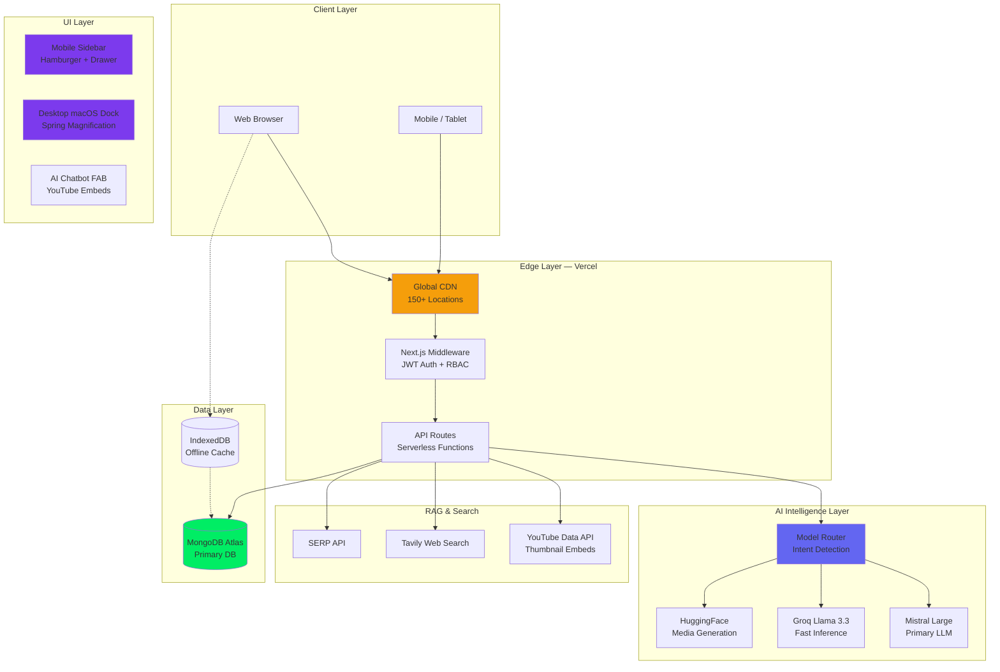

# 🐘 Ganapathi Mentor AI — The Future of AI-Powered Developer Learning

<p align="center">
  <strong>Built with ❤️ by <a href="https://github.com/grharsha777">G R Harsha</a></strong>
</p>

<p align="center">
  
  
  
  
  
  
</p>

---

**Ganapathi Mentor AI** is a state-of-the-art, AI-powered **Symbiotic Intelligence Platform** for developer education and productivity. It acts like a **best friend who's also a senior engineer** — warm, helpful, and always available. The platform combines **Custom RAG**, **Multi-Modal AI**, **Premium Animated UI**, and **Full Responsiveness** across every device from mobile phones to large TV screens.

> 🎯 **Mission**: Democratize elite-level mentorship so every developer can accelerate from junior to expert.

---

## 🚀 Core Features

### 🤖 Ganapathi AI Chatbot — Your Coding Buddy
- **Best Friend Personality** — Talks like a helpful friend, not a robot. Uses casual, encouraging language.
- **Context-Aware RAG** — Understands your page, learning history, and code context.
- **Multi-Model Intelligence** — Routes to **Mistral**, **Groq**, or **Hugging Face** for optimal response.
- **YouTube Thumbnail Embeds** — Videos shown as rich embedded cards with play buttons (not plain links).
- **Built-in Tools** — Web search, YouTube search, image generation, and in-app navigation.
- **Markdown Rendering** — Code blocks with copy-to-clipboard, styled links, bold/headings, inline code.
- **Identity**: Always identifies as **Ganapathi AI** built by **G R Harsha**.

### 📱 Fully Responsive Design — Mobile to TV
- **Mobile Sidebar Navigation** — Slide-out drawer with hamburger menu (no lag!)
- **Desktop macOS Dock** — Spring-animated magnification dock with iOS-style gradient icons
- **Touch-Optimized** — All interactive elements use `touch-action: manipulation`, `active:scale` effects
- **Fluid Typography** — `clamp()` CSS for text that scales from 320px phones to 4K screens
- **Safe Area Support** — Proper `env(safe-area-inset-*)` for notched phones (iPhone, Galaxy)
- **Reduced Motion** — Respects `prefers-reduced-motion` for accessibility

### 🧠 Neural Concept Engine
- **Adaptive Explanations** — ELI5 (Beginner) → Professional → Research-grade depth
- **Visual Learning** — Auto-generated Mermaid diagrams and flowcharts
- **Mastery Tracking** — Concepts stored in MongoDB with skill vectors

### 🗺️ Personalized Learning Paths
- **Role-Based Roadmaps** — Frontend, Backend, Full Stack, DevOps, and more
- **AI-Generated Curriculum** — 4-week milestones with curated resources
- **Dynamic Progress Tracking** — Hybrid MongoDB + IndexedDB persistence
- **Session Completion Handling** — Pages update correctly when all sessions complete

### 🎥 AI Media Studio
- **Image Generation** — Freepik & HuggingFace integrations
- **Video Generation** — HuggingFace text-to-video models
- **Music** — Suno AI integration for focus music
- **Branding Generator** — AI-powered logos, color palettes, typography

### 🛠️ Developer Productivity Suite
- **Code Reviewer** — AI + static analysis for bugs, security, anti-patterns
- **Doc Generator** — Auto-generate JSDoc, Python docstrings, READMEs
- **Eisenhower Matrix** — AI-driven task prioritization
- **GitHub Integration** — OAuth + repo analytics, commit history, language breakdown

### 🏆 Interview & Challenges
- **Mock Interviews** — Voice-first AI interviews with real-time feedback
- **Coding Challenges** — Timed challenges with scoring
- **Performance Scoring** — Technical depth, communication, problem-solving metrics

### 🔬 Research Hub
- **Unified Search** — Wikipedia, arXiv, Semantic Scholar, Tavily web search
- **Stack Exchange** — Programming Q&A integration
- **Citation Management** — Save and organize research findings

### 👥 Team Collaboration
- **Team Workspaces** — Create teams with role-based access (owner/admin/member/viewer)
- **Shared Learning Paths** — Team-wide roadmaps and progress tracking
- **Leaderboards** — Weekly XP rankings for motivation
- **CodeCollab** — Collaborative coding environment

### 📊 Analytics & Anomaly Detection
- **Personal Dashboard** — Streak, XP, level, weekly goals
- **Performance Charts** — Learning velocity, skill distribution
- **Anomaly Detection** — AI detects unusual patterns in learning behavior

---

## 🏗️ Architecture



---

## 🛠️ Tech Stack

| Layer | Technologies |
|-------|-------------|
| **Framework** | Next.js 15 (App Router), React 19, TypeScript 5.7 |
| **Styling** | TailwindCSS, Shadcn/UI, CSS Variables |
| **Animations** | Framer Motion 12 (desktop dock), CSS transitions (mobile) |
| **Icons** | Lucide React |
| **Database** | MongoDB Atlas (primary), IndexedDB (offline cache) |
| **Auth** | JWT (jose), bcryptjs, HTTP-only cookies |
| **AI Models** | Mistral Large, Groq Llama 3.3, HuggingFace |
| **Search** | YouTube Data API, Tavily, SERP API |
| **Media** | Freepik, HuggingFace (image/video gen) |
| **Hosting** | Vercel Edge Network |
| **Analytics** | Vercel Analytics |

---

## 🔌 API Integrations

| Category | Service | Function |
|----------|---------|----------|
| **LLMs** | Mistral, Groq, HuggingFace | Chat, code review, concept explanation |
| **Search** | Tavily, SERP, YouTube Data API | Web search, video discovery |
| **Media** | Freepik, HuggingFace | Image & video generation |
| **Code** | GitHub (Octokit) | Repo analytics, commit history |
| **Research** | Semantic Scholar, arXiv, Wikipedia | Academic paper search |
| **Music** | Suno AI | Focus music generation |

---

## 📱 Responsive Design Strategy

| Screen | Navigation | Optimizations |
|--------|------------|---------------|
| **Mobile** (< 640px) | Hamburger → Slide-out Sidebar | Zero framer-motion, CSS-only animations, reduced `backdrop-blur`, safe-area insets |
| **Tablet** (640-1024px) | Hamburger → Slide-out Sidebar | Touch-friendly 44px tap targets, fluid typography |
| **Desktop** (1024-1536px) | macOS Magnification Dock | Spring-animated icons, hover tooltips, active glow rings |
| **Large/TV** (1536px+) | macOS Magnification Dock | Max-width container (1600-1800px), centered layout |

---

## 🔒 Security

- **JWT Authentication** — Stateless, HTTP-only cookies, 7-day expiration
- **Password Hashing** — bcrypt with salt rounds
- **Server-Side Secrets** — All API keys on server only, never exposed to client
- **Input Validation** — Zod schemas for runtime validation
- **XSS Protection** — React built-in + Content Security Policy
- **Rate Limiting** — API rate limits to prevent abuse
- **Encryption** — MongoDB Atlas AES-256 at rest, TLS 1.3 in transit

---

## 🚀 Getting Started

### Prerequisites
- Node.js 18+
- MongoDB Atlas account
- At least one AI API key (Mistral or Groq)

### Setup
```bash
# Clone the repository
git clone https://github.com/grharsha777/ganapathi-mentor-ai.git
cd ganapathi-mentor-ai

# Install dependencies
npm install

# Set up environment variables
cp .env.example .env.local
# Fill in your API keys

# Run development server
npm run dev
```

### Environment Variables
```env
MONGODB_URI=mongodb+srv://...
JWT_SECRET=your-secret-key
MISTRAL_API_KEY=your-key
GROQ_API_KEY=your-key
HUGGINGFACE_API_KEY=your-key
YOUTUBE_API_KEY=your-key
NEXT_PUBLIC_BASE_URL=http://localhost:3000
```

---

## 📁 Project Structure

```
neural-code-symbiosis/
├── app/                          # Next.js App Router
│   ├── api/                      # API Routes
│   │   ├── chat/route.ts         # AI Chatbot (RAG + multi-model)
│   │   ├── auth/                 # Login, Register, OAuth
│   │   ├── learning/             # Learning path CRUD
│   │   ├── concepts/             # Concept engine
│   │   └── media/                # Image/video generation
│   ├── dashboard/                # Dashboard pages
│   │   ├── layout.tsx            # Responsive layout + dock
│   │   ├── page.tsx              # Main dashboard
│   │   ├── learning/             # Learning paths
│   │   ├── code-review/          # Code reviewer
│   │   ├── concepts/             # Concept engine
│   │   ├── analytics/            # Performance + anomalies
│   │   ├── collaboration/        # Team features
│   │   ├── research/             # Research hub
│   │   ├── media/studio/         # Media studio
│   │   ├── challenges/           # Coding challenges
│   │   ├── interview/            # Mock interviews
│   │   ├── collab/               # CodeCollab
│   │   ├── portfolio/            # Portfolio builder
│   │   └── settings/             # User settings
│   ├── layout.tsx                # Root layout + viewport
│   └── globals.css               # Responsive CSS + utilities
├── components/
│   ├── chat/global-chatbot.tsx   # AI chatbot (YouTube embeds)
│   ├── dashboard/
│   │   ├── dock.tsx              # Dual-render dock/sidebar
│   │   └── nav.tsx               # Responsive nav bar
│   └── layout/
│       ├── PageShell.tsx         # Responsive page wrapper
│       └── PageHeader.tsx        # Responsive page header
├── lib/                          # Utilities & services
│   ├── ai.ts                     # AI model orchestration
│   ├── auth.ts                   # JWT + bcrypt
│   ├── mongoose.ts               # MongoDB connection
│   └── youtube.ts                # YouTube search
├── models/                       # Mongoose schemas
└── .kiro/specs/                  # Design & requirements docs
```

---

## 👨‍💻 Author

**G R Harsha** — Creator & Full-Stack Developer

- 🔗 [GitHub](https://github.com/grharsha777)
- 💼 [LinkedIn](https://www.linkedin.com/in/grharsha777/)
- 📧 [grharsha777@gmail.com](mailto:grharsha777@gmail.com)

---

## 📄 License

Distributed under the **MIT License**. See `LICENSE` for more information.

---

<p align="center">
  <strong>⭐ Star this repo if Ganapathi Mentor AI helped you learn something new! ⭐</strong>
</p>
