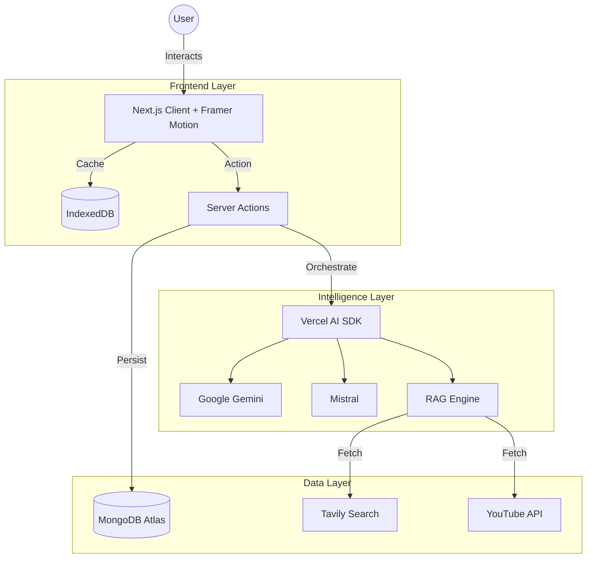

# Ganapathi Mentor AI 🐘 The Future of AI Learning

**Built with ❤️ by [G R Harsha](https://github.com/grharsha777)**

 

**Ganapathi Mentor AI** is a state-of-the-art, AI-powered learning ecosystem designed to be your 24/7 senior engineering mentor. It leverages **Custom RAG (Retrieval-Augmented Generation)**, **Multi-Modal AI**, and **Premium Animated UI** to provide a deeply personalized coding education experience.

---

## 🚀 Key Features

### 🤖 **Ganapathi AI Chatbot (Custom RAG)**
- **Context-Aware**: Understands your learning history, current page, and code context.
- **RAG-Powered**: Fetches real-time answers from documentation, StackOverflow, and trusted sources.
- **Multi-Model Intelligence**: Switches between **Google Gemini**, **Mistral**, **Claude**, and **Groq** for optimal performance.
- **Interactive Tools**: Can generate images, write code, search the web, and even compose study music.

### 🧠 **Neural Concept Engine**
- **Adaptive Explanations**: Explains concepts like "System Design" or "React Hooks" at Beginner, Intermediate, and Advanced levels.
- **Visual Learning**: Auto-generates mermaid diagrams and flowcharts to visualize complex logic.

### 🎨 **Premium UI & Animations**
- **Framer Motion Powered**: Silky smooth page transitions, floating interaction elements, and micro-interactions.
- **Animated FAB**: A custom-designed, interactive floating action button with a robot mascot that reacts to user state.
- **Glassmorphism Design**: Modern, clean, and accessible dark-mode-first aesthetic.

### 🗺️ **Personalized Learning Paths**
- **Role-Based Roadmaps**: Generates custom curriculums for Frontend, Backend, DevOps, or Full Stack roles.
- **Dynamic Progress Tracking**: Persists your journey using a hybrid MongoDB + IndexedDB architecture.

### 🎥 **AI Media Studio**
- **Image Generation**: Integrated **Picsart** & **Freepik** APIs for creating project assets.
- **Video & Avatar**: **HeyGen** integration for AI-generated mentor videos.
- **Voice Synthesis**: **ElevenLabs** & **Murf.ai** for realistic text-to-speech explanations.
- **Music Generator**: **Suno AI** integration to create focus music for coding sessions.

### 🛠️ **Developer Productivity Tools**
- **Code Reviewer**: Static analysis + AI insight to refactor code and detect anti-patterns.
- **Doc Generator**: Instantly creates comprehensive documentation from raw code.
- **Eisenhower Matrix**: AI-driven task prioritization.

---

## 🛠️ Tech Stack

### **Frontend**
- **Framework**: [Next.js 15 (App Router)](https://nextjs.org/)
- **Core**: React 19 (Server Components + Actions)
- **Language**: TypeScript (Strict Mode)
- **Styling**: TailwindCSS v4, Shadcn/UI
- **Animations**: **Framer Motion** (Complex gestures & layout animations)
- **Icons**: Lucide React

### **Backend & Infrastructure**
- **Runtime**: Vercel Edge Functions & Serverless
- **Database**: **MongoDB Atlas** (Primary), **IndexedDB** (Offline Caching)
- **Auth**: JWT-based Secure Authentication with Supabase reference integration.
- **Validation**: Zod & React Hook Form

### **AI & ML Layer**
- **Orchestration**: **Vercel AI SDK** (Unified API for all LLMs)
- **Search & RAG**: Tavily API, Serper API, Semantic Scholar
- **Video Intelligence**: YouTube Data API v3

---

## 🔌 API Integrations

The platform orchestrates a symphony of top-tier AI APIs:

| Category | Service | Key Function |
|---|---|---|
| **LLMs** | **Google Gemini, Mistral, Anthropic, Groq** | Core reasoning, coding, chat |
| **Search** | **Tavily, Serper, Semantic Scholar** | Real-time web knowledge retrieval |
| **Video** | **YouTube Data API** | Curated tutorial fetching |
| **Media Gen** | **HeyGen, Picsart, Freepik, Suno** | Video, Image, and Music generation |
| **Voice** | **ElevenLabs, Murf.ai** | Premium Text-to-Speech |
| **Data** | **TMDB, TVDB** | Media metadata for project examples |

---

## 🔒 Security & Performance
- **Hybrid Storage**: Critical data in MongoDB, transient state in IndexedDB for instant load times.
- **Secure Handling**: Server-side API key management; no keys exposed to client.
- **Edge Caching**: Vercel Edge Network for low-latency global access.

---

## 🏗️ Architecture

---

## 👨‍💻 Author

**G R Harsha**
- [GitHub](https://github.com/grharsha777)
- [LinkedIn](https://www.linkedin.com/in/grharsha777/)
- [Email](mailto:grharsha777@gmail.com)

---

## 📄 License

Distributed under the MIT License.
