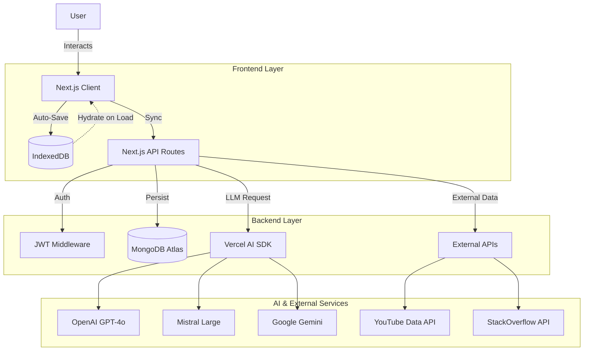

# Ganapathi Mentor AI 🐘

**A Next-Generation AI-Powered Learning Ecosystem for Developers.**

Ganapathi Mentor AI is a comprehensive platform designed to accelerate developer growth through personalized, multi-modal learning experiences. It combines advanced RAG (Retrieval-Augmented Generation), real-time code analysis, and interactive tools to serve as a 24/7 senior engineering mentor.

 
*(Note: Replace with actual banner if available)*

---

## 🚀 Key Features

### 🧠 **Neural Concept Engine**
- **Multi-Modal Explanations**: Breaks down complex topics (e.g., "Event Loop", "Closures") into beginner/intermediate/advanced tiers.
- **RAG-Powered**: Retrieves up-to-date context from trusted documentation and community sources (StackOverflow, MDN).
- **Curated Media**: Fetches relevant YouTube tutorials and research papers automatically.

### 🔍 **Intelligent Code Review**
- **Deep Static Analysis**: Identifies anti-patterns, security vulnerabilities, and performance bottlenecks.
- **Architectural Insights**: Suggests design patterns (Singleton, Factory, Observer) appropriate for the code context.
- **Auto-Documentation**: Generates comprehensive documentation and usage examples.

### 🗺️ **Adaptive Learning Roadmaps**
- **Dynamic Curriculum**: Generates personalized learning paths based on current role and target goals.
- **Progress Tracking**: Persists progress across sessions using a dual-layer storage system.
- **Resource Integration**: Direct links to GitHub repositories and interactive tutorials.

### 🎤 **Voice-First Interview Prep**
- **Real-Time Simulation**: AI interviewer conducts technical, behavioral, and system design rounds.
- **Speech-to-Text**: Transcribes user answers and provides instant feedback on clarity, technical accuracy, and tone.
- **Role-Specific Scenarios**: Tailored questions for Frontend, Backend, DevOps, and Full Stack roles.

### 🎨 **Creative Studio**
- **Image Generation**: Create assets for projects using specialized prompts.
- **Diagramming**: Auto-generate Mermaid.js architecture diagrams from code snippets.

### ⚡ **Productivity Hub**
- **Eisenhower Matrix AI**: Automatically prioritizes tasks based on urgency and impact.
- **Smart Agenda Builder**: Converts unstructured notes into structured meeting agendas.

---

## 🛠️ Tech Stack

### **Frontend**
- **Framework**: [Next.js 15 (App Router)](https://nextjs.org/)
- **Language**: TypeScript
- **UI Architecture**: React 19 (Server Components + Client Hooks)
- **Styling**: TailwindCSS v4, Shadcn/UI, Framer Motion (Animations)
- **State Management**: React Hooks + Custom Persistence Layer

### **Backend & AI**
- **AI Runtime**: [Vercel AI SDK](https://sdk.vercel.ai/docs)
- **Video Intelligence**: YouTube Data API v3
- **Knowledge Sources**: StackExchange API, Wikipedia API
- **Database**: 
  - **MongoDB** (Atlas): Durable user data and content history.
  - **IndexedDB** (Dexie-like wrapper): Offline-first local caching for instant load times.

### **Infrastructure**
- **Authentication**: JWT-based secure auth system.
- **Deployment**: Vercel (Edge Functions + Serverless).

---

## 🏗️ Architecture

The application follows a **Hybrid Persistence Architecture** to ensure zero data loss and offline capability.



---

## 🔌 API Integrations

| Service | Usage | Key |
|---|---|---|
| **OpenAI / Mistral / Gemini** | Core reasoning, code generation, RAG synthesis | `OPENAI_API_KEY` etc. |
| **YouTube Data API** | Fetching curated video tutorials | `YOUTUBE_API_KEY` |
| **StackExchange API** | Real-time community solutions | No Key (Public) |
| **MongoDB Atlas** | User persistence and history | `MONGODB_URI` |

---

## ⚡ Getting Started

### 1. Clone the Repository
```bash
git clone https://github.com/grharsha777/ganapathi-mentor-ai.git
cd ganapathi-mentor-ai
```

### 2. Install Dependencies
```bash
npm install
# or
pnpm install
```

### 3. Environment Setup
Create a `.env.local` file in the root directory:

```env
# Database
MONGODB_URI=mongodb+srv://...

# Auth
JWT_SECRET=your_super_secret_key

# AI Services (Add at least one)
OPENAI_API_KEY=sk-...
MISTRAL_API_KEY=...
GOOGLE_GENERATIVE_AI_API_KEY=...

# External Data
YOUTUBE_API_KEY=...
GITHUB_ACCESS_TOKEN=...
```

### 4. Run Locally
```bash
npm run dev
```
Open [http://localhost:3000](http://localhost:3000) to see the app.

---

## 🤝 Contributing

Contributions are welcome! Please feel free to submit a Pull Request.

1. Fork the Project
2. Create your Feature Branch (`git checkout -b feature/AmazingFeature`)
3. Commit your Changes (`git commit -m 'Add some AmazingFeature'`)
4. Push to the Branch (`git push origin feature/AmazingFeature`)
5. Open a Pull Request

---

## 📄 License

Distributed under the MIT License. See `LICENSE` for more information.

---

**Built with ❤️ by [G R Harsha](https://github.com/grharsha777)**
